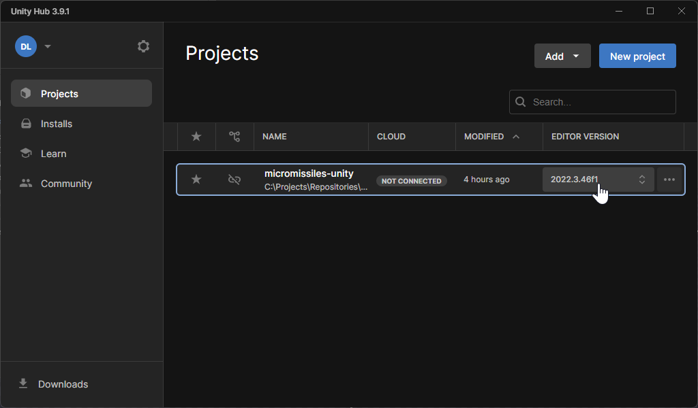

# Development Guide

This guide will help you set up and run the project in development mode. You'll learn how to install Unity Hub, open the project, and navigate the main scene.

## Table of Contents

- [Prerequisites](#prerequisites)
- [Installation Steps](#installation-steps)
  - [1. Install Unity Hub](#1-install-unity-hub)
  - [2. Clone the Project Repository](#2-clone-the-project-repository)
  - [3. Launch the Project via Unity Hub](#3-launch-the-project-via-unity-hub)
  - [4. Open the Main Scene](#4-open-the-main-scene)
- [Next Steps](#next-steps)
- [Additional Resources](#additional-resources)

## Prerequisites

- A computer with internet access.
- Administrative privileges to install software.
- [Git](https://git-scm.com/downloads) installed on your system (optional, for cloning the repository).

## Installation Steps

### 1. Install Unity Hub

Unity Hub is a desktop application that manages your Unity projects and installations. It simplifies the process of installing different Unity versions and launching projects.

**Steps to Install Unity Hub:**

1. Visit the [Unity Download Page](https://unity3d.com/get-unity/download).
2. Click on **"Download Unity Hub"**.
3. Run the downloaded installer and follow the on-screen instructions to complete the installation.

### 2. Clone the Project Repository

Obtain the project source code by cloning the repository from GitHub.

```bash
git clone https://github.com/PisterLab/micromissiles-unity.git
```
Alternatively, you can download the repository as a ZIP file and extract it to a preferred location.

### 3. Launch the Project via Unity Hub



1. **Open Unity Hub**.

2. **Add the Project to Unity Hub**:
   - Navigate to the **"Projects"** tab.
   - Click on the **"ADD"** button.
   - Browse to the folder where you cloned or extracted the project.
   - Select the folder containing the `Assets` folder and click on **"Select Folder"**.

3. **Install the Required Unity Version**:
   - Unity Hub will detect if the project requires a Unity version that is not currently installed.
   - A notification or warning icon may appear next to the project name.
   - Click on the notification and select **"Install Unity **[version]**"**.
   - Unity Hub will download and install the required Unity version automatically.

4. **Open the Project**:
   - Once the required Unity version is installed, click on the project name in Unity Hub to open it.

### 4. Open the Main Scene

After the project opens in Unity:

1. In the **Project** window (usually located at the bottom), navigate to:

   ```
   Assets/Scenes/
   ```

2. Find the main scene file, usually named `MainScene.unity`.

3. Double-click on `MainScene.unity` to open it.

4. The scene will load in the **Scene** view. You can now run the simulation by clicking the **Play** button at the top of the Unity Editor.


## Additional Resources

- [Keybinds and Controls](Keybinds_and_Controls.md)
- [Simulation Configuration Guide](Simulation_Config_Guide.md)
