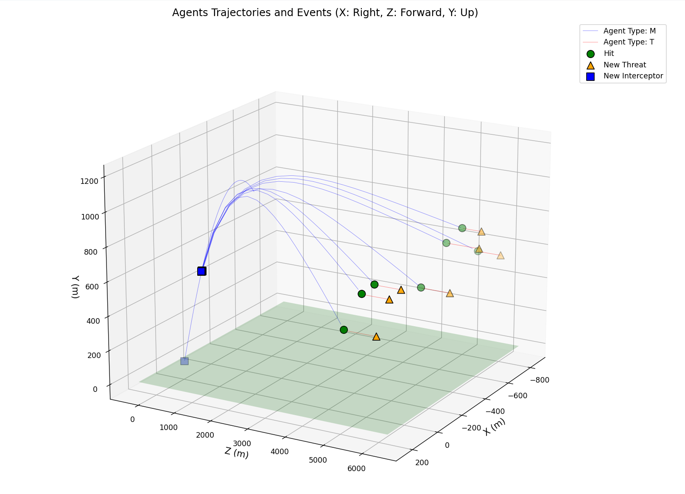

# Simulation Logging 

This guide provides instructions on how to access and interpret the simulation logs, how they are structured by the `SimMonitor` class, and how to utilize the provided `visualize_log.py` script to analyze simulation data. Additionally, it offers guidance on creating your own scripts for custom analysis.

## Overview



Simulation logs capture detailed telemetry and event data from each simulation run. These logs are essential for debugging, performance analysis, and understanding the behavior of agents within the simulation.

Logs are exported to the `Telemetry/Logs` folder in your operating system's [persistent data path](https://docs.unity3d.com/ScriptReference/Application-persistentDataPath.html).

For example, on Windows, the logs are exported to:

```
C:\Users\<user>\AppData\LocalLow\BAMLAB\micromissiles\Telemetry\Logs
```

On macOS, the logs are exported to:

```
~/Library/Application Support/BAMLAB/micromissiles/Telemetry/Logs
```

`visualize_log.py` is an example script provided to help visualize and interpret the simulation logs. It is included in the `Tools` directory of the release download.


## Understanding Log Files and Directory Structure

### Log Directory Structure

Simulation logs are organized into timestamped directories within the `Logs` folder. Each simulation run generates a new directory named with the timestamp of the run.

For example:

```
Telemetry/
└── Logs/
    ├── 20241002_101305/
    │   ├── sim_telemetry_20241002_101311.csv
    │   ├── sim_events_20241002_101311.csv
    │   │
    │   ├── sim_telemetry_20241002_101306.csv
    │   └── sim_events_20241002_101306.csv
    ├── 20241002_012122/
    │   ├── sim_telemetry_20241002_012122.csv
    │   └── sim_events_20241002_012122.csv
    └── ...
```

Each simulation run produces two main CSV files:

- **Telemetry Log (`sim_telemetry_*.csv`)**: Contains detailed state information for each agent at each time step.
- **Event Log (`sim_events_*.csv`)**: Records significant events such as hits, misses, agent creation, and destruction.

### Log Files Generated by `SimMonitor`

The logging system is managed by the `SimMonitor` class in the simulation codebase.

```csharp
public class SimMonitor : MonoBehaviour
{
    // Responsible for logging simulation data
    // ...
}
```

**Key Responsibilities of `SimMonitor`:**

- Collecting agent state data at each simulation step.
- Writing telemetry data to `sim_telemetry_*.csv`.
- Recording significant events to `sim_events_*.csv`.
- Organizing logs into timestamped directories for each simulation run.

### Telemetry Log Structure

The telemetry log provides a snapshot of the simulation at each time step for every agent. Key columns include:

- **`Time`**: Simulation time at the log entry.
- **`AgentID`**: Unique identifier for each agent.
- **`AgentType`**: Type of the agent (e.g., interceptor, threat).
- **`AgentX`**, **`AgentY`**, **`AgentZ`**: Position coordinates of the agent.
- **`AgentVelocityX`**, **`AgentVelocityY`**, **`AgentVelocityZ`**: Velocity components.
- **`AgentStatus`**: Current status of the agent (e.g., active, destroyed).

### Event Log Structure

The event log records significant occurrences within the simulation. Key columns include:

- **`Time`**: Time when the event occurred.
- **`PositionX`**, **`PositionY`**, **`PositionZ`**: Position where the event occurred.
- **`EventType`**: Type of event (e.g., `HIT`, `MISS`, `NEW_THREAT`, `NEW_INTERCEPTOR`).
- **`Details`**: Additional details about the event.


## Running the `visualize_log.py` Script

The `visualize_log.py` script helps visualize agent trajectories and significant events in a 3D plot.

### Locating the Script

After downloading and extracting the release package, you can find the script at:

```
Tools/visualize_log.py
```

Make sure you have Python 3 installed on your system, along with the required libraries to run the script.

### Required Python Libraries

The script depends on the following Python libraries:

- **`pandas`**
- **`matplotlib`**
- **`numpy`**

You can install them using `pip`:

```bash
pip install pandas matplotlib numpy
```

### Usage

#### Navigate to the Tools Directory

Open a terminal or command prompt and navigate to the `Tools` directory:

```bash
cd path/to/Tools/
```

#### Run the Script

To visualize the most recent simulation logs:

```bash
python visualize_log.py
```

**What the Script Does:**

- **Automatically Finds the Latest Logs**: If no arguments are provided, it locates the most recent `sim_telemetry_*.csv` and `sim_events_*.csv` files.
- **Prints a Summary**: Outputs a summary of events, including total counts and timing of hits and misses.
- **Generates a 3D Plot**: Displays agent trajectories and marks events such as hits and misses.

#### Specifying Log Files Manually

You can also provide specific file paths as arguments:

```bash
python visualize_log.py path/to/sim_telemetry_file.csv path/to/sim_events_file.csv
```

### Example Output

```
Total number of events: 150

Event Counts:
  HIT: 120
  MISS: 30

First hit at 5.00 seconds, last hit at 15.00 seconds

[3D plot window opens showing trajectories and events]
```

### Interpreting the Plot

The 3D plot displays:

- **Agent Trajectories**: Lines representing the paths of interceptors and threats.
  - **Colors** indicate agent types (e.g., blue for interceptors, red for threats).
- **Event Markers**: Symbols marking where events occurred.
  - **Hits**: Marked with green circles.
  - **Misses**: Marked with red crosses.

### Adjusting the Visualization

- **View Angle**: You can rotate the 3D plot by clicking and dragging to view the simulation from different perspectives.
- **Zoom**: Use the scroll wheel to zoom in and out.

## Writing Your Own Scripts

The simulation logs are in CSV format, making them accessible for custom analysis and visualization.

### Getting Started

- **Choose a Programming Language**: Python or MATLAB are recommended for ease-of-use and data analysis capabilities.

For example, using Python and the `pandas` library, you can load the telemetry and event data like this:

```python
import pandas as pd

telemetry_df = pd.read_csv('path/to/sim_telemetry_*.csv')
event_df = pd.read_csv('path/to/sim_events_*.csv')
```

### Visualization

- **2D Plots**: Use `matplotlib` to create time-series plots:

```python
import matplotlib.pyplot as plt

plt.plot(telemetry_df['Time'], telemetry_df['AgentY'])
plt.xlabel('Time (s)')
plt.ylabel('Altitude (m)')
plt.title('Agent Altitude Over Time')
plt.show()
```

- **3D Plots**: Use `mpl_toolkits.mplot3d` for 3D trajectory plots.

### Sample Script: Calculating Miss Distances

```python
import pandas as pd
import numpy as np

# Load telemetry and event data
telemetry_df = pd.read_csv('path/to/sim_telemetry_*.csv')
event_df = pd.read_csv('path/to/sim_events_*.csv')

# Filter miss events
miss_events = event_df[event_df['Event'] == 'MISS']

# Calculate miss distances
miss_distances = []
for idx, miss in miss_events.iterrows():
    agent_id = miss['AgentID']
    time = miss['Time']
    # Get agent position at the time of miss
    agent_state = telemetry_df[(telemetry_df['AgentID'] == agent_id) & (telemetry_df['Time'] == time)]
    if not agent_state.empty:
        x = agent_state['AgentX'].values[0]
        y = agent_state['AgentY'].values[0]
        z = agent_state['AgentZ'].values[0]
        # Calculate distance to target or predefined point
        distance = np.sqrt(x**2 + y**2 + z**2)
        miss_distances.append(distance)

# Output average miss distance
average_miss_distance = np.mean(miss_distances)
print(f'Average Miss Distance: {average_miss_distance:.2f} meters')
```

### Suggestions for Analysis

- **Performance Metrics**: Determine interception success rates, average time to intercept, or hit accuracy.
- **Behavioral Analysis**: Examine how changes in simulation configurations affect agent behavior.
- **Batch Processing**: Automate analysis over multiple simulation runs to compare different scenarios.

## Additional Resources

- **Python Documentation**: [pandas](https://pandas.pydata.org/), [matplotlib](https://matplotlib.org/), [NumPy](https://numpy.org/)
